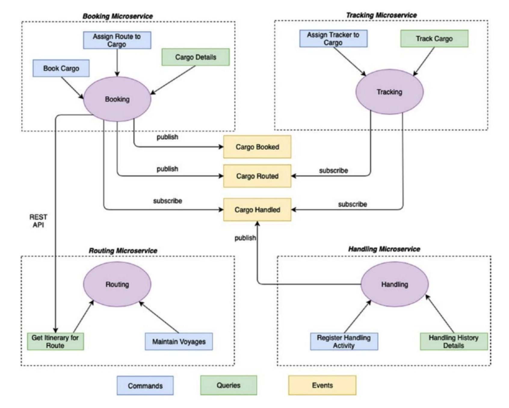

# Cargo Tracker应用

## 微服务架构

Cargo Tracker的微服务架构如下：


上下文包括：
- Booking上下文
- Tracking上下文
- Routing上下文
- Handling上下文


### Booking上下文
Booking上下文：
- 提供的接口包括：
    - Book Cargo (Command)
    - Assign Route to Cargo (Command)
    - Cargo Details (Query)
- 调用其他上下文提供的接口：
    - Routing上下文提供的Get ltinerary for Route (Query)
- 发布的事件包括：
    - Cargo Booked
    - Cargo Routed
- 订阅的事件包括：
    - Cargo Handled

### Tracking上下文
Tracking上下文：
- 提供的接口包括：
    - Assign Tracker to Cargo (Command)
    - Track Cargo (Query)
- 订阅的事件包括：
    - Cargo Routed
    - Cargo Handled

### Routing上下文
Routing上下文：
- 提供的接口包括：
    - Maintain Voyages (Command)
    - Get ltinerary for Route (Query)
- 订阅的事件包括：
    - Cargo Routed
    - Cargo Handled

### Handling上下文
Handling上下文：
- 提供的接口包括：
    - Register Handling Activity (Command)
    - Handling History Details (Query)
- 发布的事件包括：
    - Cargo Handled

## 微服务列表

微服务包括：
- `bookingms` - 对应Booking上下文
- `handlingms` - 对应Handling上下文
- `routingms` - 对应Routing上下文
- `trackingms` - 对应Tracking上下文

每个微服务为一个Spring Boot应用，包含的依赖有：
- spring-boot-starter-web
- spring-boot-starter-data-jpa
- spring-cloud-starter-stream-rabbit

分布式事务处理：
Implement **Distributed Transactions using event choreography** with a custom implementation utilizing Spring Boot and Spring Cloud Stream

## 代码结构

### 上下文包结构

以Booking上下文为例，包结构如下：
```bash
├── BookingmsApplication.java # Spring Boot应用程序入口
├── application # 应用层
├── domain # 领域层
├── infrastructure # 基础设施层，出站适配器
└── interfaces # 接口，入站适配器
```

### 接口


#### REST API
以Booking上下文为例，该上下文提供的REST API包括：
- 命令接口（改变状态的请求）
    - Book Cargo Command
    - Assign Route to Cargo Command
- 查询接口（获取状态的请求）
    - Retrieve Cargo Booking Details
    - List all Cargos

这些REST API定义在`interfaces/rest/CargoBookingController.java`类中。
该Controller类中使用了`CargoBookingCommandService`类和`CargoBookingQueryService`类，分别对应命令操作和查询操作。

Booking上下文接口的包结构如下：
```bash
interfaces
└── rest # REST API
    ├── CargoBookingController.java # 定义REST API的Spring Boot RestController
    ├── dto
    │   └── BookCargoResource.java # 
    └── transform
        └── BookCargoCommandDTOAssembler.java
```

#### 接口数据转换

参见上面Booking上下文接口的包结构。

在`interfaces/dto`包下，定义REST API的API Resources （就是一个普通的Data Transfer Object）。

在`interfaces/transform`包下，定义数据转换类，将REST API的API Resource或Event Data转换成Command/Query Service所需要的模型。

> 数据转换也可以使用专门的数据转换工具框架，而不需要每个每个类都写一个数据转换类。


#### 事件处理

另外`interfaces/events`下的EventHandler类用来订阅和处理相应的Domain Event。

以Tracking上下文为例，Tracking上下文订阅了`CargoRouted`的Domain Event，因此`interfaces/events/CargoRoutedEventHandler.java`类用来订阅和处理`CargoRoutedEvent`。


## References
- https://github.com/Apress/practical-ddd-in-enterprise-java/tree/master/Chapter5

