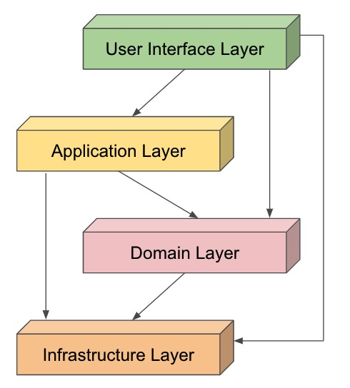
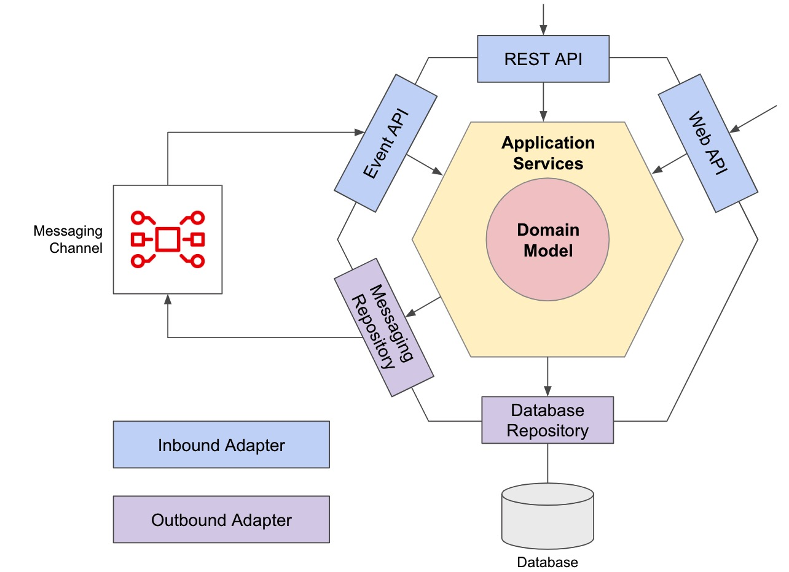

# DDD代码结构

## DDD架构

### DDD分层架构

传统的DDD分层架构如下：



分层包括：
- UI Layer
- Application Layer
- Domain Layer
- Infrastructure Layer

### 六边形架构

六边形架构（也称端口/适配器架构）如下：



分层包括：
- Inbound Adaptor
- Outbound Adaptor
- Application Service
- Domain Model

### DDD代码结构

融合DDD分层架构与六边形架构，定义DDD代码结构如下：
- `interfaces` - 接口 / 入站适配器 Inbound Adaptor
- `applicaiton` - 应用层 Application Service / Application Layer
- `domain` - 领域层 Domain Model / Domain Layer
- `infrastructure` - 基础设施层 / 出站适配器 Outbound Adaptors / Infrastructure Layer


## DDD单体应用的代码结构

一个Bounded Context作为单体应用的一个Module。

代码结构:
```bash
├── module # 单体应用的一个Module
│   ├── application # 应用层
│   │   ├── internal
│   │   │   ├── commands # 命令
│   │   │   ├── events # 事件
│   │   │   └── queries # 查询
│   │   ├── saga # Saga事务处理
│   │   └── transform # 数据传输对象（DTO）转换
│   ├── domain # 领域层
│   │   ├── aggregates # 聚合
│   │   ├── entities # 实体
│   │   └── valueobjects # 值对象
│   ├── infrastructure # 基础设施层 / 出站适配器
│   │   ├── events # 事件处理
│   │   ├── messaging # 消息处理
│   │   └── persistence # 数据持久化
│   └── interfaces # 接口 / 入站适配器，接口按通信协议分类
│       ├── file # 文件接口
│       ├── rest # REST API
│       ├── socket # WebSocket接口
│       └── web # Web API接口
└── shared # 共享服务
    └── infrastructure
        └── events
```

生成代码结构命令：
```bash
cd monolith
bash init_module_structure.sh
```

## DDD微服务应用的代码结构

一个Bounded Context为一个单独的Microservice。

代码结构:
```bash
├── application # 应用层
│   └── internal
│       ├── commandservices # 命令服务
│       ├── outboundservices # 出站服务
│       └── queryservices # 查询服务
├── domain # 领域层
│   └── model # 领域模型
│       ├── aggregates # 聚合
│       ├── commands # 命令
│       ├── entities # 实体
│       ├── events # 事件
│       └── valueobjects # 值对象
├── infrastructure # 基础设施层 / 出站适配器
│   ├── brokers # 消息代理，用于集成消息中间件
│   ├── configuration # 应用配置
│   └── repositories # 存储库，用于集成数据库基础设施
└── interfaces # 接口 / 入站适配器，接口按通信协议分类
    ├── eventhandlers # 事件处理
    ├── rest # REST API
    └── transform # 接口数据转化，将传入的API资源/事件数据转换成领域模型所需的相应命令/查询模型
```

生成代码结构命令：
```bash
cd microservices
bash bash init_microservice_structure.sh
```

## References

- [DDD, Hexagonal, Onion, Clean, CQRS, … How I put it all together](https://herbertograca.com/2017/11/16/explicit-architecture-01-ddd-hexagonal-onion-clean-cqrs-how-i-put-it-all-together/)
- https://github.com/Apress/practical-ddd-in-enterprise-java